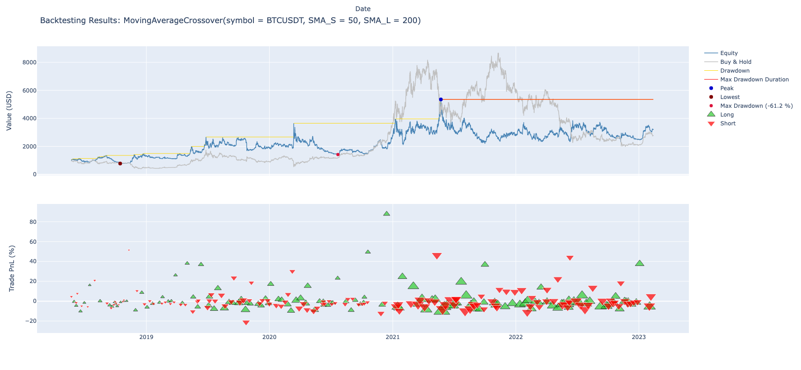
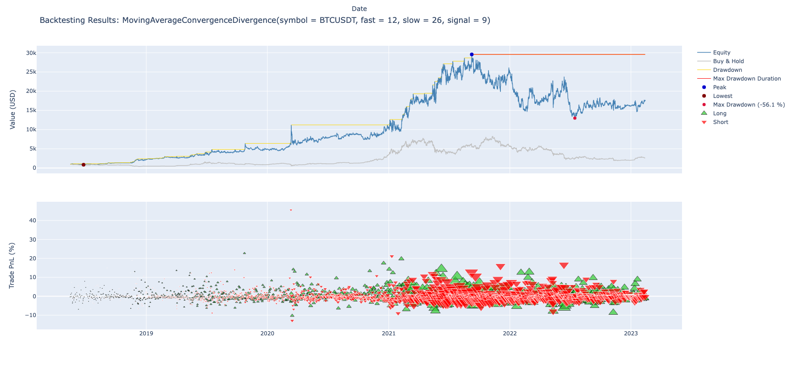
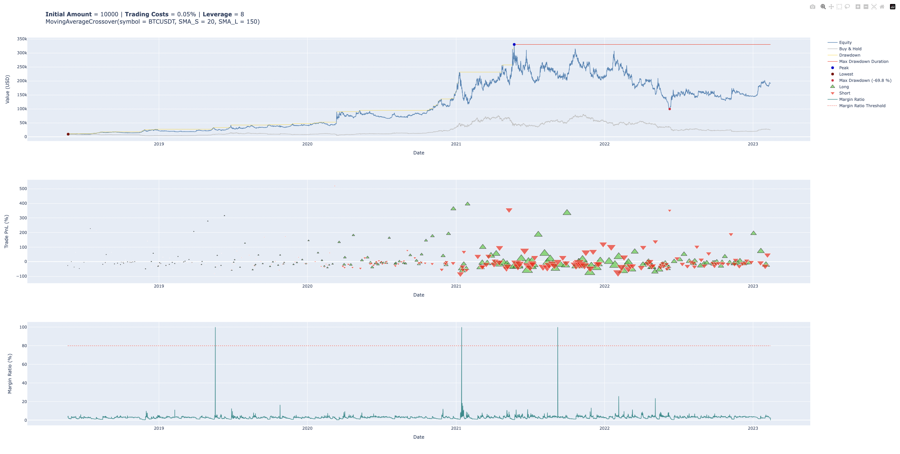
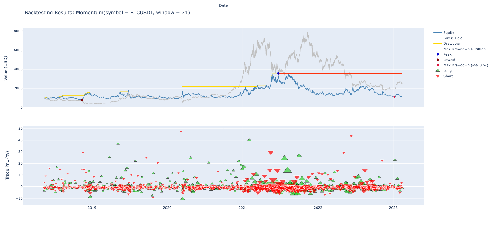

# Model Module Usage

The `Model` module is a Python package that provides a framework for backtesting trading
strategies. It contains a collection of pre-implemented trading strategies, as well as
tools for analyzing and visualizing the performance of these strategies.

To use the `Model` module, users can simply import the package and select one of the pre-implemented
strategies to backtest. Alternatively, users can create their own custom strategies by extending
the existing classes and implementing their own methods.

This module provides a convenient and flexible way for users to explore and experiment
with different trading strategies, and to evaluate their performance under different market
conditions. By providing a standardized interface for defining and testing trading strategies,
the Model module makes it easy for users to compare and evaluate different approaches to trading,
and to gain insights into the factors that contribute to successful trading.

Overall, the `Model` module is a powerful tool for anyone interested in developing, testing,
and refining trading strategies, whether for personal use or for professional trading applications.

## Backtesting 

This module offers 2 types of Backtesting - Vectorized and Iterative. Below they are described in more detail
and examples are given. It is also shown how to use the optimization API in order to fine tune the strategies and 
find the best parameters.

### Vectorized Backtesting

Thee `VectorizedBacktester` class is a backtesting framework that allows you to test trading strategies
on historical price data. It has the advantage of being faster than the iterative backtesting, but at
a cost of flexibility, as it will be hard or outright not possible to accomplish this for some more 
complex strategies. For all the strategies provided by this library, vectorized backtesting is supported.

Below is an example of how to use it for the `MovingAverageConvergenceDivergence` strategy:

```python
from model.backtesting import VectorizedBacktester
from model.strategies import MovingAverageCrossover

symbol = "BTCUSDT"
trading_costs = 0.1 # This should be in percentage, i.e. 0.1% 

mov_avg = MovingAverageCrossover(50, 200)

vect = VectorizedBacktester(mov_avg, symbol, amount=1000, trading_costs=trading_costs) # Initializes the IterativeBacktester class with the strategy.
vect.load_data() # Load the default sample data. You can pass your own DataFrame to 'load_data'
vect.run() # Runs the backtest and shows the results
```

This will output the results in textual and graphical form.

```
Total Duration: 4 years, 38 weeks and 4 days
Start Date: 2018-05-23 13:00:00
End Date: 2023-02-13 00:00:00
Total Trades: 267
Exposure Time [%]: 100.0
Buy & Hold Return [%]: 175.98
Total Return [%]: 221.6
Equity Final [USDT]: 3212.75
Equity Peak [USDT]: 5351.51
Annualized Return [%]: 21.49
Annualized Volatility [%]: 73.95
Sharpe Ratio: 0.07
Sortino Ratio: 0.28
Calmar Ratio: 0.35
Max Drawdown [%]: -61.18
Avg Drawdown [%]: -8.2
Max Drawdown Duration: 1 year, 38 weeks and 8 hours
Avg Drawdown Duration: 3 weeks, 2 days and 13 hours
Win Rate [%]: 32.21
Best Trade [%]: 87.77
Worst Trade [%]: -26.76
Avg Trade [%]: 0.09
Max Trade Duration: 5 weeks, 3 days and 14 hours
Avg Trade Duration: 6 days, 11 hours and 11 minutes
Profit Factor: 1.0
Expectancy [%]: 5.75
System Quality Number: -0.02
```

<p align="left">
  
</p>

### Iterative Backtesting

The `IterativeBacktester` class is a backtesting framework that allows you to test trading strategies
on historical price data. It works by iterating through each historical data point and simulating
trades based on your strategy. Below is an example of how you would backtest the `MovingAverageCrossover`
strategy. 

```python
from model.backtesting import IterativeBacktester
from model.strategies import MovingAverageConvergenceDivergence

symbol = "BTCUSDT"

macd = MovingAverageConvergenceDivergence(26, 12, 9)

ite = IterativeBacktester(macd, symbol=symbol) # Initializes the VectorizedBacktester class with the strategy
ite.load_data() # Load the default sample data. You can pass your own DataFrame to load_data
ite.run() # Runs the backtest and shows the results
```
This will output the results in textual and graphical form.

```
Total Duration: 4 years, 39 weeks and 4 days
Start Date: 2018-05-16 15:00:00
End Date: 2023-02-13 00:00:00
Total Trades: 3140
Exposure Time [%]: 100.0
Buy & Hold Return [%]: 163.16
Total Return [%]: 1642.05
Equity Final [USDT]: 17420.49
Equity Peak [USDT]: 29566.42
Annualized Return [%]: 61.01
Annualized Volatility [%]: 70.98
Sharpe Ratio: 0.17
Sortino Ratio: 0.8
Calmar Ratio: 1.09
Max Drawdown [%]: -56.09
Avg Drawdown [%]: -5.46
Max Drawdown Duration: 1 year, 22 weeks and 4 days
Avg Drawdown Duration: 1 week, 1 day and 20 hours
Win Rate [%]: 34.84
Best Trade [%]: 31.32
Worst Trade [%]: -14.73
Avg Trade [%]: 0.05
Max Trade Duration: 2 days and 14 hours
Avg Trade Duration: 13 hours, 14 minutes and 55.41 seconds
Profit Factor: 1.01
Expectancy [%]: 1.7
System Quality Number: 0.17
```
<p align="left">
  
</p>

### Backtesting with Leverage and Margin

Both the Vectorized and Iterative backtesting classes provide users with the ability to incorporate leverage into a 
backtest and visualize the margin ratio as a curve on the results plot. This feature enables users to identify 
instances where a margin call would occur, leading to a potential loss of all funds. The calculations follow the 
rules outlined by Binance, as detailed [here](https://www.binance.com/en/support/faq/how-to-calculate-liquidation-price-of-usd%E2%93%A2-m-futures-contracts-b3c689c1f50a44cabb3a84e663b81d93)
and [here](https://www.binance.com/en/support/faq/leverage-and-margin-of-usd%E2%93%A2-m-futures-360033162192). 
It's important to note that these calculations assume the selected margin is _Isolated_, and the position mode
is _One Way_. To utilize this functionality, follow these steps:

```python
from model.backtesting import VectorizedBacktester
from model.strategies import MovingAverageCrossover

symbol = "BTCUSDT"
trading_costs = 0.1 # This should be in percentage, i.e. 0.1% 

mov_avg = MovingAverageCrossover(20, 150)

vect = VectorizedBacktester(
    mov_avg,
    symbol,
    amount=10000,
    trading_costs=trading_costs,
    include_margin=True,  # This tells the backtester to include the margin calculations 
    leverage=10  # Here one can choose the desired leverage
)

vect.load_data()
vect.run()
```

This will output the following results and plot:

```
Total Duration: 4 years, 38 weeks and 6 days
Total Trades: 406
Start Date: 2018-05-21 11:00:00
End Date: 2023-02-13 00:00:00
Trading Costs [%]: 0.1
Leverage [x]: 10
Initial Capital [USDT]: 10000
Exposed Capital [USDT]: 1000.0
Exposure Time [%]: 100.0
Buy & Hold Return [%]: 1575.25
Total Return [%]: 11823.16
Equity Final [USDT]: 128103.44
Equity Peak [USDT]: 258579.01
Annualized Return [%]: 124.56
Annualized Volatility [%]: 71.89
Sharpe Ratio: 0.15
Sortino Ratio: 0.7
Calmar Ratio: 0.73
Max Drawdown [%]: -72.82
Avg Drawdown [%]: -6.23
Max Drawdown Duration: 1 year, 38 weeks and 8 hours
Avg Drawdown Duration: 1 week, 2 days and 23 hours
Win Rate [%]: 28.08
Best Trade [%]: 492.58
Worst Trade [%]: -117.4
Avg Trade [%]: 0
Max Trade Duration: 3 weeks, 4 days and 2 hours
Avg Trade Duration: 4 days, 6 hours and 10 minutes
Profit Factor: 1.04
Expectancy [%]: 4.48
System Quality Number: 0.19
```
<p align="left">
  
</p>

As evident from the results, employing a leverage of `10` led to at least 6 margin calls during the backtest, 
making the overall strategy impractical in a real-world scenario.

### Optimization

You can use the optimization API of either the iterative or vectorized backtester in order to find the best combination 
of parameters for a backtest. Below is an example of how to achive this.

```python
from model.backtesting import VectorizedBacktester
from model.strategies import Momentum

symbol = "BTCUSDT"
trading_costs = 0.1

mom = Momentum(30) # Initialize the strategy object with any values. 

vect = VectorizedBacktester(mom, symbol=symbol, trading_costs=trading_costs) # It could also have been the
                                                                             # IterativeBacktester class

vect.load_data() # Load the default sample data. You can pass your own DataFrame to load_data

vect.optimize(dict(window=(40, 90))) # Pass as an argument a dictionary with the parameters as keywords and 
                                     # with a tuple with the limits to test as the value. In this case we are
                                     # testing the strategy with the parameter 'window' between the values of
                                     # 40 and 90

```

This will output the best parameters and show the corresponding results.

<p align="left">
  
</p>


## Strategies

### Combined Strategies

It is possible to combine 2 or more strategies into one, by means of the `StrategyCombiner` class. The options
for combining the strategies are `Unanimous` or `Majority`. The `Unaninmous` option signals a buy or a sell
if the individual strategy signals all agree (unanimous), whereas the `Majority` method provides a buy a 
or sell signal if the majority of the individual strategy signals points in one direction. 

Here's an example of how that could be achieved:

```python
from model.backtesting import VectorizedBacktester
from model.strategies import MovingAverageCrossover, Momentum, BollingerBands
from model.backtesting.combining import StrategyCombiner

symbol = "BTCUSDT"
trading_costs = 0.1

mov_avg = MovingAverageCrossover(30, 200)
momentum = Momentum(70)
boll_bands = BollingerBands(20, 2)

# The strategies are passed on to StrategyCombiner as list.
combined = StrategyCombiner([mov_avg, momentum, boll_bands], method='Unanimous')

vect = VectorizedBacktester(combined, symbol, amount=1000, trading_costs=trading_costs)
vect.load_data() # Load the default sample data. You can pass your own DataFrame to 'load_data'

vect.run()
```

This strategy combiner class can also be optimized using the same API, with the difference that the 
optimization parameters have to be passed in an array. See the next example:

```python
from model.backtesting import VectorizedBacktester
from model.strategies import MovingAverageCrossover, Momentum
from model.backtesting.combining import StrategyCombiner

symbol = "BTCUSDT"
trading_costs = 0.1

mov_avg = MovingAverageCrossover(30, 200)
momentum = Momentum(70)

# The strategies are passed on to StrategyCombiner as list.
combined = StrategyCombiner([mov_avg, momentum], method='Majority')

vect = VectorizedBacktester(combined, symbol, amount=1000, trading_costs=trading_costs)
vect.load_data() # Load the default sample data. You can pass your own DataFrame to 'load_data'

# The optimization parameters are passed as an array of dictionaries containing the parameter intervals and step
# for each individual strategy.
vect.optimize([dict(sma_s=(20, 40)), dict(window=(60, 80))])
```


### Develop a new strategy

This module comes with some default strategies ready to be used, but chances are you will want
to expand this and create your own strategies. This can be easily achieved by using the template class below, 
which inherits the `StrategyMixin` class:

```python
from collections import OrderedDict
from model.strategies._mixin import StrategyMixin


class MyStrategy(StrategyMixin):
    """
    Description of my strategy

    Parameters
    ----------
    parameter1 : type
        Description of parameter1.
    parameter2 : type, optional
        Description of parameter2, by default default_value.

    Attributes
    ----------
    params : OrderedDict
        Parameters for the strategy, by default {"parameter1": lambda x: x}

    Methods
    -------
    __init__(self, parameter1, parameter2=default_value, **kwargs)
        Initializes the strategy object.
    update_data(self)
        Retrieves and prepares the data.
    calculate_positions(self, data)
        Calculates positions based on strategy rules.
    get_signal(self, row=None)
        Returns signal based on current data.
    """

    def __init__(self, parameter1, parameter2=default_value, data=None, **kwargs):
        """
        Initializes the strategy object.

        Parameters
        ----------
        parameter1 : type
            Description of parameter1.
        parameter2 : type, optional
            Description of parameter2, by default default_value.
        data : pd.DataFrame, optional
            Dataframe of OHLCV data, by default None.
        **kwargs : dict, optional
            Additional keyword arguments to be passed to parent class, by default None.
        """
        self._parameter1 = parameter1
        self._parameter2 = parameter2

        self.params = OrderedDict(parameter1=lambda x: x)

        StrategyMixin.__init__(self, data, **kwargs)

    def update_data(self, data):
        """
        Updates the input data with additional columns required for the strategy.

        Parameters
        ----------
        data : pd.DataFrame
            OHLCV data to be updated.

        Returns
        -------
        pd.DataFrame
            Updated OHLCV data containing additional columns.
        """
        super().update_data(data)

        # Code to update data goes here. Check the given strategies for an example.
        
        return data

    def calculate_positions(self, data):
        """
        Calculates positions based on strategy rules.

        Parameters
        ----------
        data : pd.DataFrame
            OHLCV data.

        Returns
        -------
        pd.DataFrame
            OHLCV data with additional 'position' column containing -1 for short, 1 for long.
        """
        # Code to calculate positions goes here

        return data

    def get_signal(self, row=None):
        """
        Returns signal based on current data.

        Parameters
        ----------
        row : pd.Series, optional
            Row of OHLCV data to generate signal for, by default None.

        Returns
        -------
        int
            Signal (-1 for short, 1 for long, 0 for neutral).
        """
        # Code to generate signal goes here

        return signal

```

You would replace "MyStrategy" with the name of your strategy, and replace "Description of my strategy"
with a brief explanation of what your strategy does. Similarly, "parameter1" and "parameter2" would be
replaced with the names of your strategy's parameters, and "type" would be replaced with the appropriate
data types.

The params attribute is an OrderedDict that specifies the default parameters for your strategy. 
The key is the parameter name, and the value is a lambda function that converts the user's input
into the appropriate data type.

In `__init__()`, you would initialize the strategy object with the appropriate parameters, and 
call StrategyMixin.__init__(self, data, **kwargs) to initialize the parent class.

`update_data()` should contain code to retrieve and prepare the data for your strategy. This 
will depend on the data source you are using. It is advised to check the provided strategies 
to see how this would be done.

`calculate_positions()` should contain code to calculate the positions for your strategy based 
on the current data. This is where you input the logic of your strategy in a vectorized way. 
Note that this may not be possible, depending on your strategy, If that's the case, this method can 
be ignored.

`get_signal()` should contain code to generate the signal for a given row of data. The signal 
should be an integer, where -1 represents a short position, 1 represents a long position, 
and 0 represents a neutrral position.
