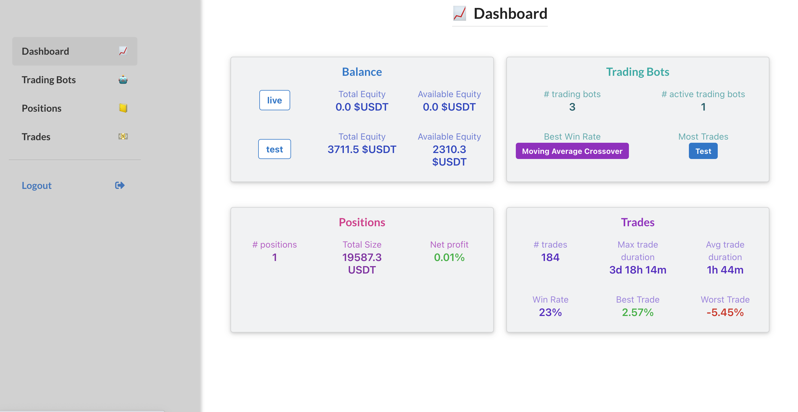
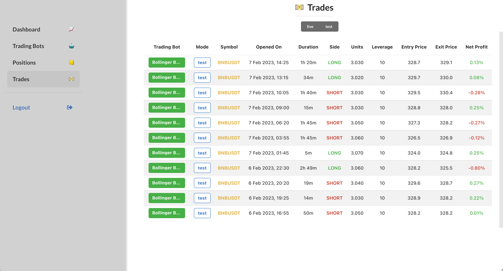
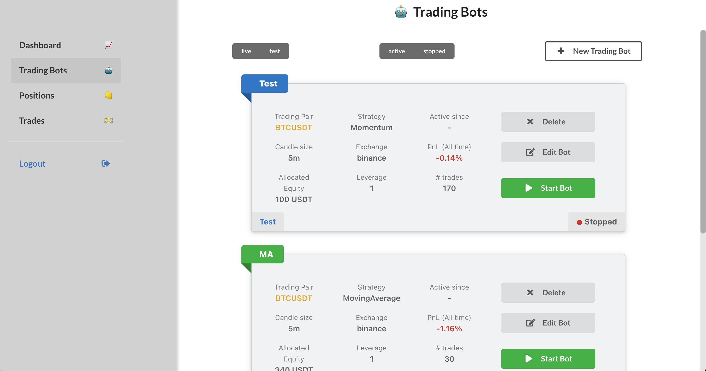
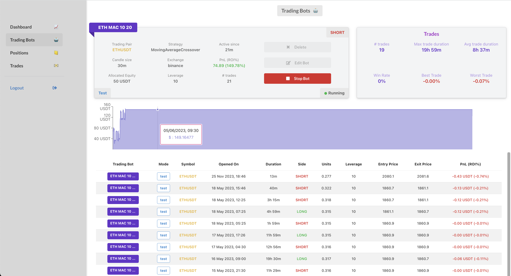
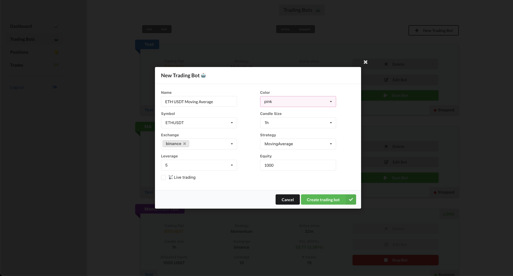
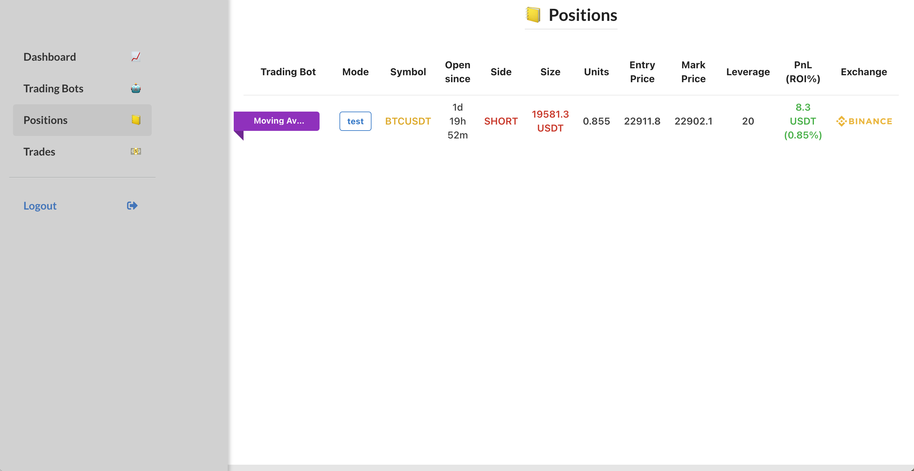

# MyCryptoBot


[](https://codecov.io/gh/diogomatoschaves/MyCryptoBot)

<p align="middle">
  
   
</p>

Welcome to the MyCryptoBot repository, a free, open source, and extensible trading platform that utilizes a 
microservices architecture. The platform empowers you to run your own trading bots and strategies locally 
or in the cloud. At present, the app is integrated with Binance, supporting both the 
[testnet](https://testnet.binancefuture.com) and [live](https://www.binance.com/en/futures) *Futures* 
accounts. Additionally, it features backtesting, plotting, and strategy optimization tools.

*Please note that the contents of this repository are not intended as trading advice or encouragement to 
start trading with real money. This platform is designed to assist existing algo traders/professionals 
in having complete control of their trading strategies and automation. Therefore, it is recommended that 
you only risk money that you are willing to lose.*

*This Repo is still under active development and under testing.*


## Installation & Usage

The detailed steps for installing and using this application locally and remotely on Heroku are provided in the
[INSTALLATION.md](INSTALLATION.md) file. However, we recommend that you understand the app's structure before 
diving into the installation steps.


## Introduction

The primary goal of this repository is to provide a platform that enables you to deploy your strategies, 
run them locally or on a remote server, and manage all your trading activities with a user-friendly web UI. 
The app comprises three micro-services that are interconnected via a database and served by a frontend web app.
There is a ready-made functionality to deploy the services to Heroku, which will require an account and associated 
monthly costs.

The app's architecture consists of the following:


### Data Service

This service acts as the data warehouse of the app. It acquires data from external sources, such as exchanges, 
preprocesses it, and stores it in a database. When a new trading bot is initiated through the user interface, 
a new data pipeline is initiated, fetching live data from the various sources. Whenever a new candle is completed, 
a request is sent to the **Model** app for processing the new data according to the strategy.

This service can also be used to retrieve historical data for any symbol.

```python
from data.sources.binance import get_historical_data
data = get_historical_data("BTCUSDT", "1h", "2021-01-01", "2021-01-31", save_file=True)
```

### Model Service

The Model service is responsible for processing the data and generating a signal (Buy or Sell) according to the 
selected strategy. Whenever a request is received to generate a new signal, the data is loaded, processed, 
and a signal is produced, which is then sent to the **Order Execution** service with an order to be executed.

This is also the module where you can add a new strategy. Check [ADD_NEW_STRATEGY.md](ADD_NEW_STRATEGY.md) for more 
details on how to do this.

### Order Execution Service

The Order Execution service acts as a layer to handle the communication between the app and the exchange. 
It receives buy and sell orders from the **Model** service with a signal, assesses whether an action is required 
(if the received signal differs from the current one), and responds accordingly.


### Web App

The user interface enables the user to start and stop trading bots, view open positions, executed trades, 
statistics, and more. The following are brief descriptions of the various views of the app.


#### Dashboard

<p align="middle">
  
</p>

This serves as the main view of the application, presenting a comprehensive overview of the equity evolution, 
trading bot data, open positions, and associated trades over time. Summary statistics are displayed to provide 
key insights. Users can easily navigate to different sections of the app by clicking on the corresponding section 
or utilizing the left-hand side menu.

#### Trading Bots

<p align="middle">
  
</p>

This page provides an overview of all existing trading bots along with their current status. 
Users have the ability to edit, start, and stop these bots directly from this view. 
Clicking on a specific trading bot leads to a detailed page, showcasing the equity evolution, 
statistics, and a comprehensive list of all trades associated with that bot.

<p align="middle">
  
</p>

Additionally, users can create a new trading bot by selecting the `New Trading Bot` button. 
Simply fill in all the required details, and the new bot will be created and initiated automatically.

<p align="middle">
  
</p>

#### Positions

<p align="middle">
  
</p>

This page displays the currently open positions linked to the trading bots.

#### Trades

<p align="middle">
  
</p>

This page shows all the trades executed by any of the trading bots. It is possible to filter by live or testnet trades.


## Software Requirements

- [Poetry](https://python-poetry.org/docs/)
- [PostgreSQL](https://www.postgresql.org/download/)
- [Docker](https://docs.docker.com/get-docker/) (For running the app locally.)
- [Heroku CLI](https://devcenter.heroku.com/articles/heroku-cli) (For deploying the app to a cloud service.)
